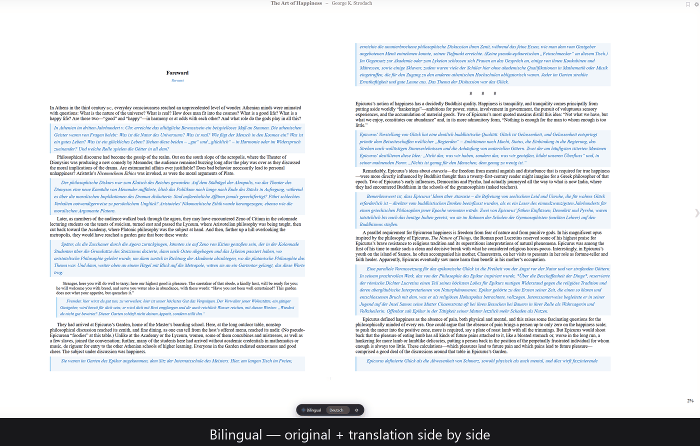

# CWA eBook Translate Plugin

Bilingual LLM-powered translation overlay for [Calibre-Web-Automated](https://github.com/crocodilestick/Calibre-Web-Automated). Translate ebooks paragraph-by-paragraph while reading — in **100+ languages** — using local LLMs (vLLM, LM Studio, Ollama) or any major Cloud API (OpenAI, Anthropic, Gemini, Groq, Together, MiniMax, DeepSeek, OpenRouter).



## ✨ Features

- 🌐 **Bilingual reading** — original + translation side by side
- 🔄 **Three modes** — Bilingual / Translation-only / Original
- 🌍 **100+ target languages** — the picker shows the 10 most-spoken languages first, then every other supported language A–Z (type to jump). Developed and tuned against **Google's Gemma 4** as the default local model; the language set mirrors Gemma's pre-training coverage
- ⚡ **Visible-First Translation** — prioritizes paragraphs visible on screen for instant rendering
- 🚀 **Background Prefetching** — translates the rest of the chapter sequentially in the background
- 🧠 **Context-Aware Translation** — feeds surrounding paragraphs to the LLM to improve literary quality and character voice
- 📚 **Deep DOM Parsing** — accurately captures headings, custom title classes, and clickable TOC links
- 💾 **Private Bounded Cache** — durable server-side SQLite uses scoped SHA-256 keys, mandatory TTL/cap, and private file modes; browser persistence is opt-in on trusted single-user devices
- 🔒 **Rate limited & Stable** — request-size caps and per-IP rate limiting protect your API keys and GPU from runaway requests, with `AbortController` cancellation for perfectly responsive UI buttons
- 🔌 **Zero-touch install** — proxy-injection mode overlays a **stock** CWA container: no template mounts, nothing to re-apply when CWA updates

### A note on language quality

The default model, **Gemma 4** (`gemma4-12b`), is pre-trained on 140+ languages
with ~35 languages receiving first-class, benchmarked support (all major
European, East Asian, South/Southeast Asian, and Middle Eastern languages).
The remaining languages in the picker come from Gemma's wider pre-training
corpus: translation works, but lower-resource languages (e.g. Nahuatl, Chewa,
Tibetan) can occasionally lose coherence or bleed into a dominant language on
complex passages. Cloud models (GPT, Claude, Gemini) generally handle the
lower-resource tier better — switch `LLM_PROVIDER` if a language matters to you.

---

## 🚀 Installation

### Recommended: proxy-injection mode (isolated API and proxy roles)

Two non-root containers run the same translator image. The proxy sits in front
of CWA and injects the overlay; the private API owns translation and cache
state. Your CWA container stays completely untouched.

```text
Browser ──► book-translator-proxy (:8084) ──► CWA (:8083, stock)
                 │ injects overlay on /read/ pages
                 └─ /bt-api → book-translator-api (:8390, private)
```

```bash
git clone https://github.com/felixapel/CWA-eBook-Translate-Plugin.git
cd CWA-eBook-Translate-Plugin
# Edit docker-compose.yml: set BT_LOCAL_URL (or a cloud provider + API key)
docker compose up -d
```

Then read your library at **`http://<host>:8084`** — the translator control
bar appears in the ebook reader. That's the whole install. The compose file
validates the browser's existing HttpOnly CWA session for every protected API
request; it does not put a translator credential in JavaScript or
`localStorage`. The API is attached to the CWA network only so it can call the
authenticated `/ajax/emailstat` probe and remains unpublished to the host.
The compose file pulls the prebuilt multi-arch image
(`ghcr.io/felixapel/cwa-ebook-translate-plugin`, amd64 + arm64) — no build
step needed. For an unattended production deployment, replace `latest` in the
Compose file with the immutable digest reported by the release workflow.

Already have CWA running? Copy the `book-translator-api` and
`book-translator-proxy` services plus their private network and named volume
from [`docker-compose.yml`](docker-compose.yml), then point `CWA_UPSTREAM` at
your existing CWA service. Keep the two roles separate in production; the
legacy combined mode exists only for upgrade compatibility.

> Removing the plugin = stop reading through the proxy port. Nothing in your
> CWA install was modified.

### Behind a reverse proxy (SWAG / Traefik / NPM / Cloudflare)

If you already expose CWA on a domain, point your reverse proxy's **main
location at the translator's proxy port instead of CWA's port** — the overlay
then works on your domain with the API same-origin (no CORS, no extra routes).
Verified SWAG example (only the main location changes; keep OPDS/Kobo sync
locations pointing directly at CWA):

```nginx
    location / {
        include /config/nginx/proxy.conf;
        include /config/nginx/resolver.conf;
        set $upstream_app 10.0.0.10;        # docker host (substitute your own)
        set $upstream_port 8084;            # translator proxy port (NOT CWA's)
        set $upstream_proto http;
        proxy_pass $upstream_proto://$upstream_app:$upstream_port;
    }
```

Set `BT_PUBLIC_ORIGIN=https://books.example.com` on the translator proxy
service (use your exact reader origin). The injection proxy forwards that
validated, fixed scheme and authority to CWA; it never trusts a browser's or
upstream request's `Host`, `Forwarded`, or `X-Forwarded-Proto` value. HTTPS
sessions and secure cookies therefore work without making those headers an
implicit trust boundary.

### Option 2: Unraid

**Community Applications (recommended once listed):** search for
**"CWA eBook Translate"** in the Apps tab. Until the listing is approved, add
the template manually — Docker tab → *Add Container* → *Template repositories*
→ add `https://github.com/felixapel/unraid-templates`, or download the
[template XML](https://raw.githubusercontent.com/felixapel/unraid-templates/main/templates/cwa-ebook-translate-plugin.xml)
into `/boot/config/plugins/dockerMan/templates-user/`. The template installs
**proxy-injection mode**: set `CWA URL` to your CWA instance and read through
this container's port — your CWA container stays stock.

#### Legacy: bind-mount installer script

`install_unraid.sh` copies the overlay files into your CWA appdata folder and
installs an Unraid Docker template for the API (bind-mount method). Review the
script, then run it **locally** (don't pipe an unreviewed remote script into
`bash`):

```bash
git clone https://github.com/felixapel/CWA-eBook-Translate-Plugin.git
cd CWA-eBook-Translate-Plugin
chmod +x install_unraid.sh
./install_unraid.sh
```

**Post-Install Steps**:
1. Go to your Unraid Docker tab and edit your `calibre-web-automated` container.
2. Add the 3 paths (as instructed by the script) to inject the plugin files.
3. Deploy the newly added `book-translator-api` container.

`deploy_unraid.sh` / `verify_unraid.sh` are personal SSH-based redeploy/verify
helpers for an existing install — read them and adapt the host/paths before use.

> Tip: proxy-injection mode also works on Unraid (run the container with
> `CWA_UPSTREAM` set and browse through its port) and avoids the 3 path
> mappings entirely.

### Advanced: bind-mount install (development / no proxy)

Mount the overlay files directly into the CWA container — useful when hacking
on the overlay itself:

```yaml
volumes:
  - ./overlay/read.html:/app/calibre-web-automated/cps/templates/read.html:ro
  - ./static/translator.js:/app/calibre-web-automated/cps/static/js/translator.js:ro
  - ./static/translator.css:/app/calibre-web-automated/cps/static/css/translator.css:ro
```

Caveats: `overlay/read.html` is a full template replacement tracked against
the **pinned CWA version in docker-compose.yml** (`v4.0.6`). A CWA update that
changes `read.html` can drift from this copy — proxy mode does not have this
problem. The shipped bind-mount overlay uses `cwa_session`; because its API is
cross-origin, set one exact `BT_ALLOWED_ORIGINS` value, keep
`BT_ALLOW_PRIVATE_LAN=false`, and configure the exact CWA auth URL. The helper
does not place a shared API secret in browser JavaScript. Its direct `:8390`
API route is HTTP-only, so the helper accepts only an `http://` reader origin;
for an HTTPS reader, use the recommended same-origin proxy or provide a
separately reviewed TLS API route and custom `apiUrl`.

---

## ⚡ Performance

Throughput and latency depend entirely on your LLM backend (local GPU/model vs. a
cloud API) and on the tunables in [Configuration](#️-configuration) — there is no
single number that applies to every setup, so we don't publish one. Two scripts are
included so you can measure *your* deployment:

- `benchmark.py` — quick concurrent load test against a running API.
- `benchmark_realistic.py` — simulates a realistic reading session (visible-page +
  background prefetch) against a live backend.

Run either with the API up (`python benchmark.py` / `python benchmark_realistic.py`)
and read the printed p50/p95/throughput for your own hardware.

If cold translations feel slow, see `BT_BATCH_SIZE`, `BT_OUTPUT_TOKEN_FACTOR`, and
`BT_MAX_CONCURRENT` below, and `docs/TROUBLESHOOTING.md`.

---

## ⚙️ Configuration

Environment variables for the translator image (set them on the role that uses
them):

| Variable | Default | Description |
|----------|---------|-------------|
| `BT_ROLE` | `auto` | Runtime role: `api`, `proxy`, or compatibility-only `all`. `auto` selects `api` without `CWA_UPSTREAM` and `all` when it is present. The reference Compose file sets roles explicitly. |
| `CWA_UPSTREAM` | | Required by the proxy role. Exact base URL of the stock CWA instance (e.g. `http://calibre-web:8083`); credentials, paths, queries, fragments, and non-HTTP schemes fail startup. |
| `BT_API_UPSTREAM` | `http://127.0.0.1:$PORT` | Exact translation API base URL used by the proxy role. The split Compose topology sets `http://book-translator-api:8390`; the same URL validation applies. |
| `BT_PROXY_PORT` | `8080` | Container port for the injection proxy (proxy mode only). |
| `BT_PUBLIC_ORIGIN` | | **Required by proxy/all roles.** Exact browser-facing origin, such as `http://192.168.1.10:8084` or `https://books.example.com`. Its validated host and scheme are the only values forwarded to CWA/API. The reference Compose file defaults to `http://localhost:8084`; override it for every non-local deployment. |
| `BT_CWA_MAX_BODY_SIZE` | `2g` | Finite nginx cap for CWA uploads. Use a positive nginx size such as `512m` or `4g`; `0`/unlimited and directive-like values fail startup. Translation API bodies retain a separate 3 MiB proxy cap and the stricter Flask limit. |
| `BT_AUTH_MODE` | `token` | Authentication authority: `cwa_session` (recommended proxy topology), `forwarded` (identity-aware reverse proxy), `token` (shared-secret compatibility), or development-only `disabled`. The default fails startup unless `BT_API_TOKEN` is present. Disabled mode additionally requires `BT_ALLOW_INSECURE_AUTH=true`. `/ping`, `/health`, and `/ready` stay unauthenticated; every other route is protected. |
| `BT_ALLOW_INSECURE_AUTH` | `false` | Required second acknowledgement for `BT_AUTH_MODE=disabled`. Never enable it in production. |
| `BT_CWA_AUTH_URL` | | Required for `cwa_session`, e.g. `http://calibre-web:8083/ajax/emailstat`. Only that exact path is accepted. The API forwards selected cookies, refuses redirects, and requires CWA's bounded JSON task-list response; it returns `503` when the authority cannot be evaluated. |
| `BT_CWA_AUTH_COOKIE_NAMES` | `session,remember_token` | CWA cookie names allowed to leave the API for the configured auth probe. All other browser cookies are dropped. |
| `BT_CWA_AUTH_TIMEOUT_SECONDS` | `2` | Bounded CWA session-probe timeout. |
| `BT_CWA_AUTH_CACHE_TTL_SECONDS` | `15` | Short positive/negative validation-cache TTL. Keys are one-way session hashes; raw cookies are never cached or logged. |
| `BT_CWA_AUTH_CACHE_MAX_ENTRIES` | `10000` | Maximum cached session-validation decisions. Oldest entries are evicted. |
| `BT_CWA_AUTH_MAX_INFLIGHT` | `8` | Maximum distinct CWA probes active at once; concurrent checks of the same session are coalesced. Saturation fails closed with `503`. |
| `BT_CWA_AUTH_MAX_RESPONSE_BYTES` | `262144` | Maximum decompressed bytes read from the CWA auth probe before JSON parsing. Oversized responses fail closed with `503`. |
| `BT_IDENTITY_TRUSTED_PROXIES` | | Required for `forwarded`. Comma-separated CIDRs/IPs allowed to set `X-BT-Subject` and optional `X-BT-Roles`; direct client headers are rejected. The subject is hashed before use as a tenant. The identity proxy must strip client-supplied copies before setting its own and be the API's immediate peer. The bundled injection proxy deliberately strips these headers and is not an identity authority; route `/bt-api` directly through the allowlisted identity proxy with no public bypass. |
| `BT_AUTH_RATE_LIMIT_PER_MINUTE` | `300` | Separate per-client limit for protected-route authentication attempts, including rejected credentials and observability endpoints. |
| `BT_RATE_LIMIT_MAX_CLIENTS` | `10000` | Maximum active client buckets in each in-memory limiter. Under saturated active cardinality, unseen clients fail closed with `429` instead of growing process memory or receiving a fresh allowance. |
| `LLM_PROVIDER` | `local` | `local`, `openai`, `anthropic`, `gemini`, `groq`, `together`, `minimax`, `deepseek`, `openrouter` |
| `LLM_MODEL` | `gemma4-12b` | Model name for the chosen provider |
| `LLM_API_KEY` | | Your API key for the chosen provider (the only supported key mechanism since 2.0.0) |
| `BT_LOCAL_URL` | `http://localhost:1234/v1/chat/completions` | Only used if `LLM_PROVIDER=local`. OpenAI-compatible endpoint — the **path is always `/v1/chat/completions`** (vLLM, LM Studio, Ollama, llama.cpp all speak it); only host:port changes (vLLM `:8000`, LM Studio `:1234`, Ollama `:11434`). **In Docker, `localhost` is the container itself** — use `http://host.docker.internal:<port>/...` or the host IP. |
| `BT_MAX_CONCURRENT` | `2` | Simultaneous translation requests (batches). For a slow single-GPU local model, `1`–`2` is **more** stable than `3` (avoids timeout cascades). |
| `BT_BATCH_SIZE` | `5` | Paragraphs translated per LLM call. `>1` is dramatically faster on slow models (one generation instead of one-per-paragraph). Batches use a strict, versioned JSON envelope; an invalid provider response fails the group atomically and is never cached. Set `1` for one-call-per-paragraph. |
| `BT_MAX_TOKENS` | `4096` | Hard ceiling on `max_tokens` for a **single**-paragraph request. The actual value sent is the smaller of this and the proportional cap (see `BT_OUTPUT_TOKEN_FACTOR`). |
| `BT_BATCH_MAX_TOKENS` | `8192` | Same ceiling, but for a **batched** (multi-paragraph) request. |
| `BT_OUTPUT_TOKEN_FACTOR` | `2.0` | Caps generated `max_tokens` at `input_tokens × FACTOR + FLOOR`, clamped to the ceiling above. Prevents a rambling/stuck local model from generating thousands of tokens for a short paragraph (the main cause of 8–20s and 120s stalls). `2.0` never truncates real translations; lower it (e.g. `1.6`) for a bit more speed at some risk on very expansive target languages. |
| `BT_OUTPUT_TOKEN_FLOOR` | `256` | Minimum `max_tokens` per request. |
| `BT_CONTEXT_WINDOW` | `0` | Number of surrounding paragraphs included as a do-not-translate `[CONTEXT]` block in batch prompts. Set to `1` or `2` for context-aware translations. Improves literary quality but consumes more tokens per request. |
| `BT_TIMEOUT` | `60` | Seconds before a single translation request is abandoned. Raise it if a slow local model times out on long paragraphs; lower it (with a smaller `BT_BATCH_SIZE`) if you'd rather fail fast under contention. |
| `LLM_FALLBACK_PROVIDER` | | Optional secondary provider. A `local` fallback may run automatically; every remote/cloud fallback is excluded from network calls, cache lookup, and singleflight unless the current API request includes `"allow_cloud_fallback": true`. |
| `LLM_FALLBACK_MODEL` | | Model name for the fallback provider. |
| `LLM_FALLBACK_API_KEY` | | API key for the fallback provider. |
| `BT_API_TOKEN` | | Required when `BT_AUTH_MODE=token`; send it as `X-BT-Token`. This compatibility mode gives every caller one shared tenant and the secret is JavaScript-readable if placed in `window.BOOK_TRANSLATOR`, so prefer `cwa_session` or `forwarded`. It is also the operator credential for `/cache/cleanup` and `/health/deep`; without it those two routes use the private persisted cleanup token in `/app/data`. The proxy loader never reads a token from `localStorage`. |
| `BT_MAX_BATCH_PARAGRAPHS` | `50` | Max paragraphs accepted per `/translate/batch` request (oversized requests get `413`). Protects your GPU/API bill from a single runaway request. |
| `BT_MAX_PARAGRAPH_CHARS` | `8000` | Max characters per paragraph (`413` beyond it). |
| `BT_MAX_CONTENT_LENGTH` | `2097152` (2 MB) | Hard cap on the request body (the WSGI-level backstop). Per-field caps (`BT_MAX_BATCH_PARAGRAPHS`, `BT_MAX_PARAGRAPH_CHARS`) check the parsed content; this cap rejects oversize bodies before parsing. Lower it for untrusted networks, raise it for very long paragraphs. |
| `BT_MAX_UPSTREAM_INFLIGHT` | `2` | Process-wide cap on simultaneous in-flight LLM calls across all readers. `BT_MAX_CONCURRENT` only bounds one batch request; this cap prevents multi-reader timeout cascades. Must be greater than zero. |
| `BT_UPSTREAM_QUEUE_TIMEOUT` | `2` | Maximum seconds to wait for a global upstream slot. A full queue returns `503` with `Retry-After` without starting a provider call. |
| `BT_SINGLEFLIGHT_MAX_ENTRIES` | `1024` | Process-wide bound on distinct active translation operations. Concurrent requests with the same tenant/book/chapter and exact prompt contract share one provider call; completed results are never retained here and must pass through the scoped SQLite cache. |
| `BT_REQUEST_MAX_ATTEMPTS` | `20` | Maximum provider calls across groups, primary, and an allowed fallback for one API request. With explicit cloud consent, batch groups use one attempt per provider, so the default exactly covers 50 paragraphs at batch size 5 when the primary fails and a healthy fallback succeeds. The single-text endpoint retains two attempts per provider. Attempts are reserved atomically before network I/O. |
| `BT_REQUEST_MAX_INPUT_BYTES` | `5000000` | Maximum cumulative UTF-8 prompt bytes reserved across every provider attempt in one API request. The default covers two passes over the largest valid default batch, including four-byte Unicode and protocol overhead. |
| `BT_REQUEST_MAX_OUTPUT_TOKENS` | `163840` | Maximum cumulative `max_tokens` reserved across every provider attempt in one API request, sized for the same bounded 20-call batch path. |
| `BT_REQUEST_DEADLINE_SECONDS` | `90` | Absolute request-wide deadline. Once expired, no new provider attempt can start; individual provider timeouts are clamped to the remaining time. |
| `BT_MAX_UPSTREAM_RESPONSE_BYTES` | `1048576` (1 MiB) | Maximum decompressed JSON bytes accepted from one provider call. Responses are streamed and aborted at the boundary before JSON materialization; providers that ignore `max_tokens` cannot grow memory/cache without limit. |
| `BT_RATE_LIMIT_PER_MINUTE` | `120` | Max requests per client IP per 60s window before the API returns `429`. |
| `BT_RATE_LIMIT_RETRY_AFTER` | `10` | Seconds reported in the `Retry-After` header / response body on a `429`. The frontend reads this and backs off automatically. |
| `BT_TRUST_PROXY` | `false` | **Legacy/dev only.** When `true`, the API uses the **last** `X-Forwarded-For` hop from any peer as the rate-limit key. A client that can reach the API directly can still spoof this header, so don't rely on it in production — prefer `BT_TRUSTED_PROXIES` below. |
| `BT_TRUSTED_PROXIES` | (empty) | **Production-safe** rate-limit-key source. Comma-separated CIDRs/IPs of peers allowed to set `X-Forwarded-For`. The reference Compose network gives the proxy a fixed address and trusts only that `/32`. Combined compatibility mode defaults to loopback. |
| `BT_ALLOWED_ORIGINS` | `http://localhost:8083,http://localhost:8383` | Comma-separated exact origins allowed for CORS (bind-mount installs; irrelevant in proxy mode, which is same-origin). Add your public reader URL here, e.g. `https://books.example.com`. |
| `BT_ALLOW_PRIVATE_LAN` | `true` | Additionally allow localhost/RFC1918 origins (`10.*`, `192.168.*`, `172.16-31.*`) on any port for non-cookie modes. `cwa_session` always ignores this broad grant: credentialed cross-origin requests require an exact `BT_ALLOWED_ORIGINS` entry and receive `Access-Control-Allow-Credentials: true`. Same-origin proxy mode needs neither. |
| `BT_CACHE_TTL_DAYS` | `90` | Mandatory maximum age for cached translations. Expired rows are never served and are removed during normal writes/stats/cleanup. Must be greater than zero. |
| `BT_CACHE_MAX_ENTRIES` | `100000` | Mandatory hard cap on schema-v2 rows. The least-recently-accessed rows are evicted in the same transaction as a write. Must be greater than zero. |
| `BT_CACHE_HIT_FLUSH_THRESHOLD` | `100` | Number of cache-hit counters batched before SQLite is updated. Translation hits stay read-only between flushes, reducing WAL contention. |
| `BT_CACHE_HARDEN_EXISTING_DIR` | `false` (`true` in image) | Change an existing cache directory to mode `0700`. New directories and all DB/WAL/SHM files are always created private; the container enables this fail-closed check. |
| `DB_PATH` | `translations.db` | Path to the SQLite translation cache. In Docker this should point inside the `/app/data` volume (the provided Dockerfile/compose already set it to `/app/data/translations.db`) so the cache survives container recreation. |
| `PORT` | `8390` | Port the API listens on. If you remap it, also update the `-p`/compose port mapping and any reverse-proxy route — `EXPOSE` in the Dockerfile is documentation only. |

Remote fallback is an additive, fail-closed API contract. Both `POST /translate`
and `POST /translate/batch` accept the optional JSON boolean
`allow_cloud_fallback`; omission means `false`, and strings/numbers are
rejected. The reader exposes an explicit privacy switch explaining that book
text will leave the local deployment. That decision is kept only in the
current book tab and is never restored from `localStorage`. Configuring a cloud
provider as the **primary** provider is a separate operator decision and sends
all normal translation requests to that provider.

> **Why a single gunicorn worker?** Rate limiting, request metrics, and the health
> cache are kept in process memory for simplicity. Running more than one worker
> would give each its own copy (e.g. the rate limit becoming `N×` the configured
> value). The `--threads 8` setting already gives plenty of request concurrency
> within that one worker — don't raise `--workers` without moving that state to
> something shared (e.g. SQLite, like the translation cache already is).

Cache schema v2 intentionally preserves an existing v1 table as
`translations_v1` but never serves those unscoped rows. The cache re-warms
without a destructive migration. V2 stores no source paragraph and hashes
tenant/book/chapter identifiers before persistence. Browser translations stay
in memory unless `window.BOOK_TRANSLATOR.persistCache = true` is explicitly set;
opt-in keys also include stable DOM position to separate repeated text in
different contexts. Legacy `bt_cache_v2_*` localStorage entries are removed on
upgrade.

The bundled injection proxy replaces any inbound forwarding chain with the
immediate peer address it actually observed. Direct LAN clients therefore keep
per-client API limits. When SWAG/Traefik/NPM is the immediate peer, the API sees
that edge proxy as one client; enforce client-aware admission at the trusted
edge or size the translator's downstream limit for the aggregate. This avoids
accepting spoofable client IPs without an explicit real-IP trust configuration.

---

## 🏗️ Architecture

```text
Browser ──► proxy role (:8080) ──► CWA (:8083, stock)
                │
                ├─ /bt-static/* → overlay js/css
                └─ /bt-api/* ──► API role (:8390) ──► providers
                                         │
                                         └─ SQLite cache (/app/data)
```

In bind-mount installs nginx never starts; the overlay files are mounted into
CWA and call the API on `:8390` directly (CORS applies — see
`BT_ALLOWED_ORIGINS`). The shipped helper exposes that port over HTTP and
therefore rejects HTTPS reader origins rather than creating a browser-blocked
mixed-content deployment. For cross-origin `cwa_session`, set
`authMode: 'cwa_session'` and `sendCredentials: true` in
`window.BOOK_TRANSLATOR`, disable `BT_ALLOW_PRIVATE_LAN`, and list the one exact
CWA reader origin. In `token` and `forwarded` modes the frontend uses
`credentials: 'omit'`, so CWA cookies are not disclosed to the API origin.

Both image roles declare `appuser` (`101:102`), run with zero capabilities, and
support a read-only root filesystem. If you replace the Compose named volume
with a host bind mount, create it with ownership `101:102`; runtime ownership
repair was intentionally removed.

`/ping` is liveness-only and `/health` plus `/ready` are shallow readiness
checks; none contacts an LLM. The provider-backed `/health/deep` endpoint is
operator-only and uses the same request budget and global provider gate as a
translation. Authenticate it with `X-BT-Token`: this is `BT_API_TOKEN` when
configured, otherwise the persisted `/app/data/cleanup_token` value.

`/metrics` reports request/cache counters, fixed HTTP status classes, bounded
authentication/rate-limit/provider/work-budget outcomes, partial-batch segment
failures, and bounded singleflight activity (`active_entries`, shared results,
follower timeouts, and capacity rejections). Metric dimensions are defined by
the server: routes, identities, book metadata, provider URLs, exception strings,
source text, and cache keys are never labels. Counters are process-local, which
is another reason the shipped runtime intentionally uses one gunicorn worker.

Authentication-derived tenant behavior is intentional:

- `cwa_session` isolates by the current session hash. Logging out/re-authenticating
  creates a cold tenant because CWA v4.0.6 does not expose a stable supported
  current-user JSON identity at this boundary.
- `forwarded` isolates by the stable subject asserted by an allowlisted identity
  proxy and is the mode to use when cache continuity across sessions matters.
- `token` is one shared tenant. `disabled` is one anonymous tenant and must not
  be used for production.

Release operators should follow the [Gitea-authoritative release
runbook](docs/RELEASE.md); GitHub is a mirror and does not publish images.
See the [architecture overview](docs/ARCHITECTURE.md) for component details and
accepted architecture decision records.

## ❤️ Support the project

CWA eBook Translate is free, GPL-licensed, and has no telemetry, ads, or
subscription — if it replaced a paid translation service for you, consider
funding its development:

- **[Ko-fi](https://ko-fi.com/felixapel)** — quick one-time tips, 0% platform fees
- **[GitHub Sponsors](https://github.com/sponsors/felixapel)** — monthly support

Donations fund GPU time for multi-model testing, coverage of the 100+
language matrix, and maintainer time on issues. Non-monetary support counts
just as much: ⭐ star the repo, report bugs with reproducible steps, test new
releases, or bring a translation of the UI strings.

## 📜 License

GPL-3.0. This project extends [Calibre-Web-Automated](https://github.com/crocodilestick/Calibre-Web-Automated)
(itself GPL-licensed), and the advanced bind-mount install ships a template
derived from it — so the whole project is licensed under the GNU GPL v3 to
keep everything clean and compatible. See [LICENSE](LICENSE).

This project is not affiliated with, endorsed by, or sponsored by
Calibre-Web, Calibre-Web-Automated, Calibre, Google (Gemma), or any LLM
provider. All names are used nominatively to describe compatibility.
