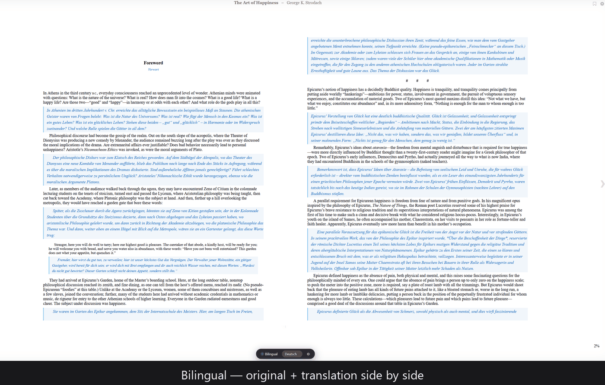

# eBook Translate for CWA and Kavita

eBook Translate adds bilingual, paragraph-level LLM translation to stock
[Calibre-Web-Automated](https://github.com/crocodilestick/Calibre-Web-Automated)
and the pinned [Kavita](https://github.com/Kareadita/Kavita) EPUB reader without
modifying either image.



## What it does

- Shows original and translated text together, or either one by itself.
- Offers 100+ source and target language choices. Translation quality depends
  on the selected model and language pair.
- Prioritizes visible paragraphs; whole-chapter prefetch is an explicit opt-in.
- Supports local, fixed named cloud and public custom OpenAI-compatible backends.
- Keeps provider credentials server-side and requires explicit consent before
  a configured local provider falls back to a cloud provider.
- Uses a private, bounded SQLite cache scoped by authenticated reader context.
- Preserves the stock reader and keeps the translation API off the host network
  in managed installations.

## Supported installation

The production path is the universal `btctl` hub. It builds an immutable local
image from an exact clean release checkout and runs CWA, Kavita or both through
one hardened container while keeping separate internal API processes, caches,
keys and cookies. Use the current annotated release:

```bash
git clone https://github.com/felixapel/CWA-eBook-Translate-Plugin.git cwa-translate
cd cwa-translate
git fetch --tags
git switch --detach v2.3.0-rc.1
```

Copy the managed configuration outside the checkout and make it private:

```bash
install -d -m 0700 /absolute/private/path
cp .env.hub.example /absolute/private/path/book-translator-hub.env
chmod 0600 /absolute/private/path/book-translator-hub.env
```

Set each enabled reader's exact container, network, version, public origin,
storage paths and LLM endpoint. A local provider normally leaves `LLM_API_KEY`
empty. Then run:

```bash
./btctl plan --env /absolute/private/path/book-translator-hub.env
./btctl install --env /absolute/private/path/book-translator-hub.env --yes
./btctl doctor --env /absolute/private/path/book-translator-hub.env
```

`plan` validates and reports the intended resources without changing the reader
or deployment state. `install` commits state only after live postconditions pass.
`doctor` is read-only and every check must report `ok`.

Provider roles are selected entirely through the private environment, with
shared defaults and optional per-reader overrides. The split profile retains
its provider-only `btctl reconfigure` workflow. A hub provider change uses a
reviewed `uninstall` with the old environment followed by `install` with the
new one; data is retained, while all reader processes restart coherently and
may require a fresh short-lived session.
See the [configuration reference](docs/reference/configuration.md).

Stock Unraid requires root, Bash, Docker and a full checkout including `.git`.
It does not require host Python, host Git or NerdTools to run `./btctl`; the
launcher uses a temporary containerized operator when needed. Linux hosts use
`BT_INSTALL_PROFILE=compose-existing`. Operators who need independent
container isolation or CWA Authentik-forwarded identity can retain the split
profile.

Community Applications uses a separate CWA-only combined-image profile. Install
it only from a searchable listing whose template pins an immutable image digest;
if no listing is present, use `btctl`. See the
[Community Applications guide](docs/install/community-applications.md).

## Runtime boundary

```text
Browser / reverse proxy -> injection proxy -> stock CWA or Kavita
                                  |
                                  +-> private translation API -> LLM
                                                     |
                                                     +-> SQLite cache
```

Managed native-reader profiles exchange existing CWA or Kavita proof for a
short-lived, opaque translator session. Raw reader credentials are confined to
the exact exchange endpoint; ordinary translation calls never receive them.
CWA strong-session binding and Kavita native/OIDC login are supported within
their documented boundaries. Do not publish the API, disable authentication,
or add a route that bypasses the managed proxy. Advanced CWA Authentik
deployments have a separate fail-closed profile and guide.

CWA is the current stable release target. The stock Kavita v0.9.0.2 EPUB
connector is contract- and CI-certified in this checkout, but remains a
candidate until physical Unraid and real-reader browser acceptance is recorded.
Manga, PDF and library writeback are not supported.

## Documentation

- [Documentation map](docs/README.md)
- [Universal CWA and Kavita hub](docs/install/universal-hub.md)
- [Managed `btctl` install](docs/install/btctl.md)
- [Kavita managed install](docs/install/kavita.md)
- [Community Applications](docs/install/community-applications.md)
- [Authentik integration](docs/install/authentik.md)
- [Lifecycle and recovery](docs/operations/lifecycle.md)
- [Troubleshooting](docs/operations/troubleshooting.md)
- [Compatibility](docs/reference/compatibility.md)
- [Configuration](docs/reference/configuration.md)
- [Architecture](docs/reference/architecture.md)

## Development and support

Read [CONTRIBUTING.md](CONTRIBUTING.md) and the
[development guide](docs/maintainers/development.md) before changing the
project. Use the issue templates for reproducible bugs and feature proposals.
Report vulnerabilities through the private channel in [SECURITY.md](SECURITY.md).

eBook Translate is GPL-3.0 software with no telemetry, ads or subscription.
Support is optional through [Ko-fi](https://ko-fi.com/felixapel) or
[GitHub Sponsors](https://github.com/sponsors/felixapel). The project is not
affiliated with or endorsed by CWA, Kavita, Calibre, Google or any LLM provider.

See [LICENSE](LICENSE) for the license text.
